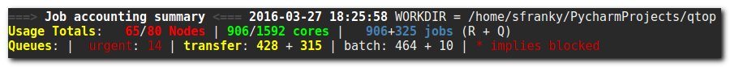
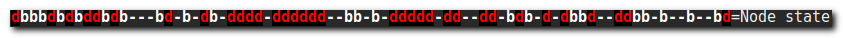
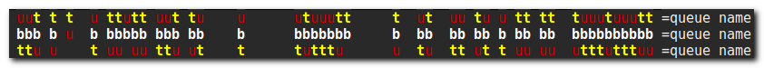
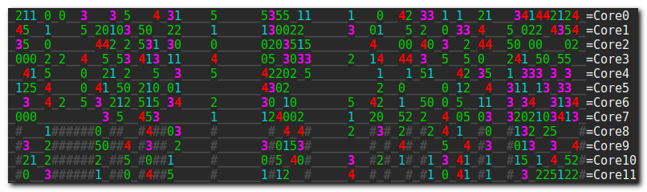
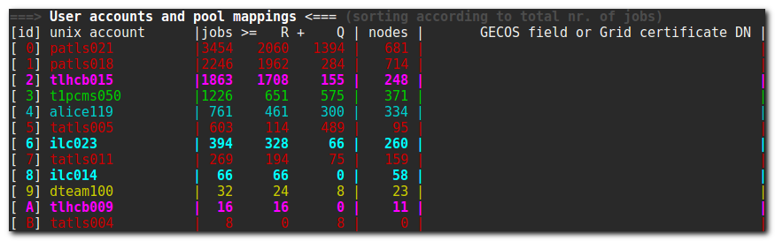
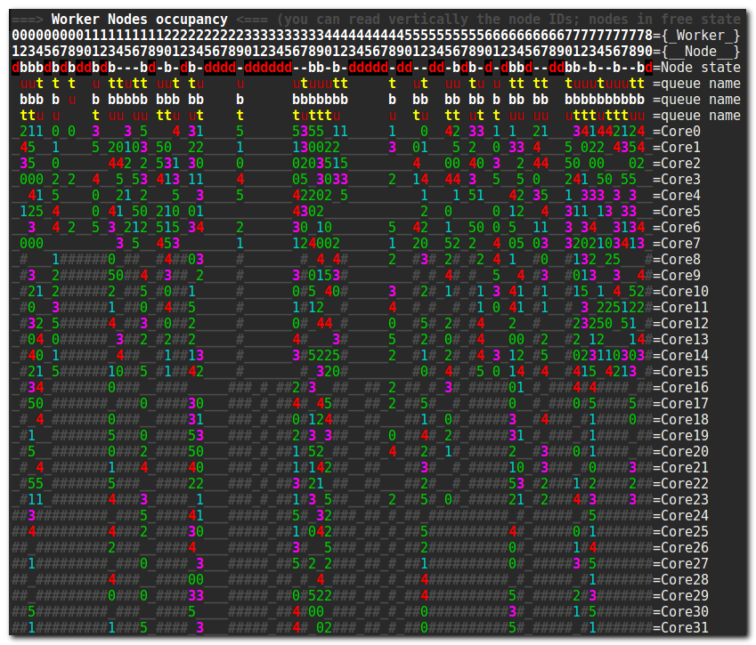

qtop.py guide
=============

-  `Introduction <#introduction>`__
-  `Quickstart <#quickstart>`__
-  `Output walkthrough <#output-walkthrough>`__
-  `Watchmode <#watch-mode>`__
-  `Instant Replay <#instant-replay>`__
-  `Customisation <#customisation>`__
-  `Command-line arguments <>`__ (TODO)
-  `Usage tips <>`__ (TODO)

Introduction
------------

Background
~~~~~~~~~~

qtop.py is based on the same-titled bash script (well, minus the .py!)
written by @fgeorgatos long ago. The main reason for rewriting it from
scratch in python was the drive to add some much-needed functionality,
which was getting harder and harder to do in bash. The new version of
qtop.py is much more extendable, so as to be able to cooperate with more
Local Resource Management Systems, such as Oracle/Sun Grid Engine
(SGE/GE), LSF, LoadLeveler, OAR, SLURM etc. It's also less buggy, with
most of the bugs of the old version eradicated ...and new ones
introduced ;-)

Goals
~~~~~

qtop.py is a tool written to summarize, textually and visually, the
state of an Resource Management System, along with some relevant
information around clusters, Grid-specific or independent. It gathers
information from the Resource Management System and organises them in a
compact yet illustrative format, for easy access. Expandability and
configurability were deemed very important and were taken into account
from the very early stages of designing qtop.py. What's more, it is
intended that the information that qtop.py gathers is reused by other
developers or system administrators, either for other purposes or in
different visualisation formats/media. For this reason, qtop.py exports
the gathered information to a convenient json format. Also, we have gone
to great lengths to keep qtop.py dependency-free. That means, you don't
have to download or install anything extra; qtop.py works out of the
box!

Quickstart
----------

The absolute simplest way to get qtop.py to display *anything* is by
invoking it in demo mode:

::

    ./qtop.py -b demo

When used, the ``-b`` switch must always be followed by one of the
supported batch systems (as of version 0.8.9, pbs, sge, oar, demo).

That should create and destroy fictional jobs in fictional machines from
fictional users, and display all that in a colorful, yet much unhelpful
way. You see, the data produced is going to be probably more than a
screenful, and so most of it is going to scroll up and away. If you want
to start making any sense of it, you're better off trying this:

::

    ./qtop.py -b demo -w

which keeps updating the screen with freshly made-up data, and also
keeps you at the beginning of it. This is called the `watch
mode <#watch-mode>`__. You'll notice that this time it's the end that
you cannot see, so now would be a good time to introduce
`keybindings <#keyboard-shortcuts>`__ to move around.

Most of what you can see on screen is customisable **on-the-fly** by
editing a `configuration file <#customisation>`__. Some modifications
can also be accomplished by using the aforementioned
`keybindings <#keyboard-shortcuts>`__.

Output walkthrough
------------------

The three qtop sections
~~~~~~~~~~~~~~~~~~~~~~~

The information that qtop.py conveys when ran can be divided into three
sections:

Accounting Summary
''''''''''''''''''

-  number of nodes (Total:available (online):Free (non-exclusive))
-  number of cores (available/total)
-  number of jobs (running/queued)
-  queue names, along with running/queued jobs info for every queue

   Accounting Summary

If a queue is denoted as blocked in the Resource Management System, it
will be marked with an asterisk.

Worker Nodes Occupancy
''''''''''''''''''''''

The heart of qtop lies in this sector, which is essentially a matrix
(potentially wrapped at the end of the terminal, resulting in a series
of matrices), modular in nature. There are two ways to visualise the
matrix, one where the columns are worker nodes and the rows are the node
characteristics, and another where the matrix is transposed, i.e. the
**rows** are the worker nodes and the columns are their characteristics.
We'll be referring to the first form in our examples, which was also the
original form used in old qtop.

The default characteristics are the node state, the names of the queues
involved and the job per core allocation table.

This, however, is customisable: as long as there are characteristics of
interest existing in the Resource Management System input file, the User
should be able to describe the characteristic inside the config file and
have a new vector spawn inside the matrix.

One dimension is used to array the worker nodes and another to expand
the worker node characteristics (individual cores, node state,
associated queues etc). |worker nodes occupancy|

The default elements displayed are:

Worker node ID (virtual or real node name)
                                          

.. figure:: images/wnid.png
   :alt: Worker Nodes ID

   worker nodes ID

The options here are either the real full name of the worker nodes, or a
numbering scheme. If the worker node numbering is atypical, e.g. from
``pc23`` there's a jump to ``pc-b-145``, the standard representation
scheme will represent such gaps with non-existent worker nodes, which
might not always be desirable. Hence, a remapping mechanism will be put
in place, giving consistent numbering starting from zero, to all nodes
belonging to the cluster.

Node state
          

   Node state

The node state is denoted with the first letter of the following, fi.
for PBS: \* **j**\ ob-exclusive \* **b**\ usy \* **o**\ ffline \*
**d**\ own

The symbol "**-**" is used when the node is free.

Queue names
           

   Queue name

The queue names sector shows the initials of the queue names loaded with
jobs running on the specific worker node. The full names of the queues
show up earlier in the Accounting Summary, color-coded in the same way.
So if you have queues all starting with the same letter, e.g. grid3000M,
grid2000M, grid5000M, the colouring will help you see which is

Job allocation table
                    

   Cores

The jobs are displayed via their owner, who is given a single-character
ID. The mapping is shown on the `User account
information <#user-account-information>`__ section. An underscore '\_'
denotes a free core. A hash symbol '#' means that the core in this
position does not exist on this worker node. If, for example, a
hundred-node cluster consists of 96 worker nodes of 32 cores and 4
worker nodes of 16 cores, the last 16 core position in those 4 worker
nodes will be substituted with the hash symbol.

User account information
''''''''''''''''''''''''

   user accounts

-  ``id`` is a symbol denoting a unique unix account
-  the jobs of every user, with distinct mention for the running jobs
   vs. the total number of jobs (including the finished ones)
-  the name of the unix account
-  Grid certificate DN, or GECOS field

The former is useful in Grid-connected clusters. It shows the owner of
the pool account at the current time.

*Note*: This can only be shown for root accounts, because of the
dependence on ``edg-mkgridpool --list``

The GECOS field either retrieves information from a cached file
(described in the config file) or gets information in realtime from
``getent passwd``

Watch mode
----------

The watch mode is a step-up from the original implementation, where the
user was able to run qtop with ``watch -d`` prepended, so as to be able
to watch an almost real-time evolution of the system monitored. Alas,
there was no way to retain qtop's coloring information with watch (not
in older versions of watch, anyway). An in-house implementation of watch
was hence inspired, and along with that came new features that original
watch doesn't provide, giving interactivity to the user, in an
ncurses-like fashion.

The options available in watch mode, as of version 0.8.9 are:

-  navigation through a big matrix, as if more/less were used (more or
   less ;) with vim-like commands
-  matrix transposition (switch between rows<->columns)
-  node ID type switch (from proper full node name to bare numbering)
-  coloring code switch (user id coloring/queue coloring)
-  real-time filtering of nodes according to name substring or
   RegEx/node state/node number

Keyboard shortcuts
~~~~~~~~~~~~~~~~~~

Navigation
''''''''''

+------------+-------------------------------+
| shortcut   | function                      |
+============+===============================+
| j/k        | go to down/up one screen      |
+------------+-------------------------------+
| h/l        | go to left/right one screen   |
+------------+-------------------------------+
| g/G        | go to top/bottom of matrix    |
+------------+-------------------------------+
| 0          | go to left end of matrix      |
+------------+-------------------------------+
| $          | go to right end of matrix     |
+------------+-------------------------------+
| r          | reset position/refresh        |
+------------+-------------------------------+

Other
'''''

+------------+------------------------+
| shortcut   | function               |
+============+========================+
| f          | apply filtering        |
+------------+------------------------+
| F          | switch node ID type    |
+------------+------------------------+
| m          | switch coloring code   |
+------------+------------------------+
| s          | apply sorting          |
+------------+------------------------+
| t          | transpose matrix       |
+------------+------------------------+
| q          | quit qtop              |
+------------+------------------------+

Instant Replay
--------------

The output of qtop is kept in ``/tmp/qtop_results_$USER`` (configurable
in ``qtopconf.yaml``), so that users can "replay" the state of their
system from a particular point in time. By default, the output is kept
for the last 24 hours, but this is also configurable in
``qtopconf.yaml``.

To replay from a specific point in time, the User must invoke:

::

    ./qtop.py -R DATETIME [DURATION]

where ``DATETIME`` can either be \* ``yyyymmddTHHMMSS``, e.g.
``20161118T182300`` (explicit form) \* ``HHMM``, e.g. ``1823`` (current
day is implied, or the previous day, depending) \* ``mmddTHHMM``, e.g.
``1118T1823`` (current year is implied)

Colons, slashes and dashes are also supported, so the User can type,
e.g. 18:23, or 11/18T18:23, instead.

A second value, ``DURATION``, is optional and denotes the desired length
of the playback. The notation for duration is ``X<unit>``, where unit
can either be ``h``, ``m``, ``s``. Example:

::

    ./qtop.py -R 1823 1h

A default duration of ``2m`` is used, if no value is given.

*Important*: What is displayed on screen during instant replay is what
was displayed at that particular moment. If the User was navigating up
and down while using filters, this is what is going to be displayed.

Customisation
-------------

Customisation is achieved by means of editing a configuration file.
Modifying most of the keys available in the configuration file can
affect the behaviour of qtop in a live manner, if running in `watch
mode <#watch-mode>`__.

The configuration file (qtopconf.yaml)
~~~~~~~~~~~~~~~~~~~~~~~~~~~~~~~~~~~~~~

YAML Format 
'''''''''''

YAML was chosen as it is human-readable and should thus be easier for
people to read and modify to their liking. That said, the configuration
file is in a YAML-\ **like** format. It does not faithfully follow the
format 100%, as it was written quickly. It was decided against using the
standard PyYAML module for two reasons:

1. support for python 2.5 was recently dropped, while we, on the other
   hand, aim to keep supporting it
2. we would very much like qtop to have zero dependencies, so that users
   can just download and run it on their potentially "sui generis"
   systems, without the need to download **any** extra packages.

This has, unfortunately, resulted in some "quirks" in the YAMLish format
now used, such as:

-  having to leave a blank line after every line of python code included
   in the configuration file (cases such as this are found in lambda
   expressions)
-  having to end single-item lists in a comma, e.g. ``['^wn-26',]``
-  two consecutive unindents not being allowed. There must always exist
   a once-unindented key-value after nested keys
-  not being able to write arbitrarily deeply nested dictionary-like
   structures, without fear it's going to break the universe.

Anyone brave enough to dive into ``yaml_parser.py``, or better still,
rewrite the darn thing, is more than welcome to, by the way. It goes
without saying that only a very basic implementation is required (what
you can see used in the configuration file, really!) and none of the
flashy features that YAML sports.

Scheduler configuration area
''''''''''''''''''''''''''''

.. code:: yaml

    ---
        savepath: /tmp/qtop_results_$USER
        schedulers:
          pbs:
            pbsnodes_file: %(savepath)s/pbsnodes_a%(pid)s.txt, pbsnodes -a
            qstatq_file: %(savepath)s/qstat_q%(pid)s.txt, qstat -q
            qstat_file: %(savepath)s/qstat%(pid)s.txt, qstat
          oar:
            oarnodes_s_file: %(savepath)s/oarnodes_s_Y%(pid)s.txt, oarnodes -s -Y
            oarnodes_y_file: %(savepath)s/oarnodes_Y%(pid)s.txt, oarnodes -Y
            oarstat_file: %(savepath)s/oarstat%(pid)s.txt, oarstat
          sge:
            sge_file: %(savepath)s/qstat%(pid)s.F.xml.stdout, qstat -F -xml -u '*'
          demo:
            demo_file: %(savepath)s/demo%(pid)s.txt, echo 'Demo here'
    ---

There are two ways to run qtop.py, data-wise: 1. run it on a Computing
Element (or similar) where qtop.py itself invokes the commands needed to
gather the cluster information 2. run it wherever, after the cluster
information has been stored locally for qtop to read.

In this area of the configuration file, two key elements are set for
each scheduler: \* the needed shell commands to run on the Computing
Element \* the filepath where the cluster information is to be saved

So, let's say your nick is Mike and you are administering an OAR
cluster. If you just invoke:

::

    ./qtop.py -b oar

then qtop is going to invoke ``oarnodes -s -Y``, ``oarnodes -Y``,
``oarstat`` consecutively, and store it, respectively, in

::

    /tmp/qtop_results_mike/oarnodes_s_Y.txt
    /tmp/qtop_results_mike/oarnodes_Y.txt
    /tmp/qtop_results_mike/oarstat.txt

If, instead, you invoke it as follows:

::

    ./qtop.py -b oar -s <path-to-cluster-information>

qtop will search for ``oarnodes_s_Y.txt``, ``oarnodes_Y.txt`` and
``oarstat.txt`` in ``<path-to-cluster-information>`` (retrieved by you,
earlier).

qtop also has a scheduler-type discovery system, meaning it will try to
guess which scheduler system is installed in your system. The keys below
let the user decide which command it should be that uniquely
characterises the scheduler. If, for example, qtop can successfully find
``qacct`` on the system where qtop is executed, it will decide SGE is
installed.

.. code:: yaml

    ---
        signature_commands:
          pbs: pbsnodes
          oar: oarnodes
          sge: qacct
          demo: echo
    ---

XML parsing
'''''''''''

.. code:: yaml

    ---
        faster_xml_parsing: False
    ---

As the input data coming from SGE systems is in XML format, the natural
choice for parsing XML data in python is the **lxml** module. That,
however, is not in the standard library, and thus requires an extra
download. For users that are unable/unwilling to install extra modules
in their systems, the standard library slower alternative is used
instead.

State abbreviations
'''''''''''''''''''

.. code:: yaml

    ---
        # Meaning of queue state abbreviations
        state_abbreviations:
          pbs:
            Q: queued_of_user
            R: running_of_user
            C: cancelled_of_user
            E: exiting_of_user
            W: waiting_of_user
          oar:
            E: Error
            F: Finishing
            S: Resuming
            H: Hold
            L: waiting_of_user
            W: queued_of_user
            R: running_of_user
            T: exiting_of_user
            S: cancelled_of_user
          sge:
             etc etc

    ---

Since every scheduler has its own set of states, here is the place where
you can inform qtop what states your particular scheduler uses. For now,
these are not linked to any special behaviour, but this should change in
the future.

Color mappings
''''''''''''''

.. code:: yaml

    ---
        user_color_mappings:  # order should be from more generic-->more specific
        # - \w+: Gray_D  # enabling this cancels all saved accounts in colormap.py
        # - [\d]+: Gray_D
        # - [A-Za-z]+0\d{2}: Red_L
        # - [A-Za-z]+15\d: Gray_D
        # - \w*lhc\w*: Cyan_L
        # - \w+00\d: Blue
        # - \w*cms\w*: Red_L
         - \w*cms048: Blue
         - \w*cms193: Gray_L
         - \w*atl\w+: Red
         - snielsen: Blue
         - ekalesaki: Cyan_L
         - zzhang: Red_L
         - mmravlak: Red_L
         - dbobbili: Cyan_L
         - patls021: Cyan_L

        queue_color_mappings:
          - alice: Red_L
          - dteam\w+: Cyan_L

        nodestate_color_mappings:
         - au: BlackOnRed
         - d: Red_LOnGrayBG
    ---

Color mappings apply for now to three types of items: \* user ids \*
queue name initials (in the queue name lines/columns) \* node state

Color mappings can be described using `regular
expressions <https://docs.python.org/2/library/re.html>`__. The standard
RegEx python module ``re`` is used for parsing. Order here matters, so
the expressions on the top of the list get overwritten by expressions on
the bottom.

Colors with backgrounds can also be used: for all the color combinations
available, check ``color_to_code`` dictionary in ``colormap.py``.

In there, you will also find a ton of ready-made colormaps
(``userid_pat_to_color_default`` dictionary), with a primary focus on
user ids found in Large Hadron Collider related clusters (WLCG grid).

